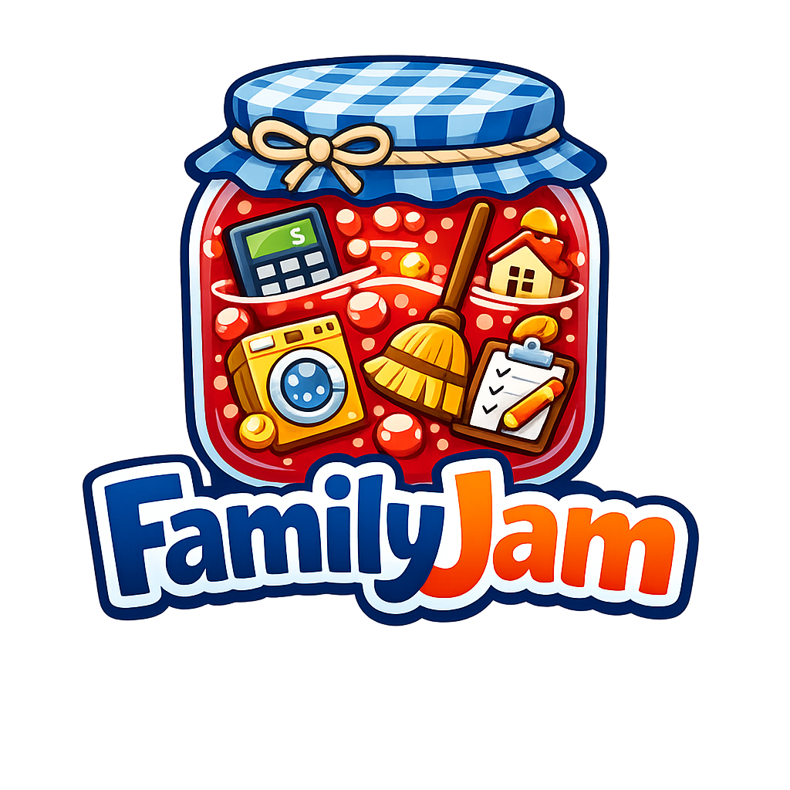
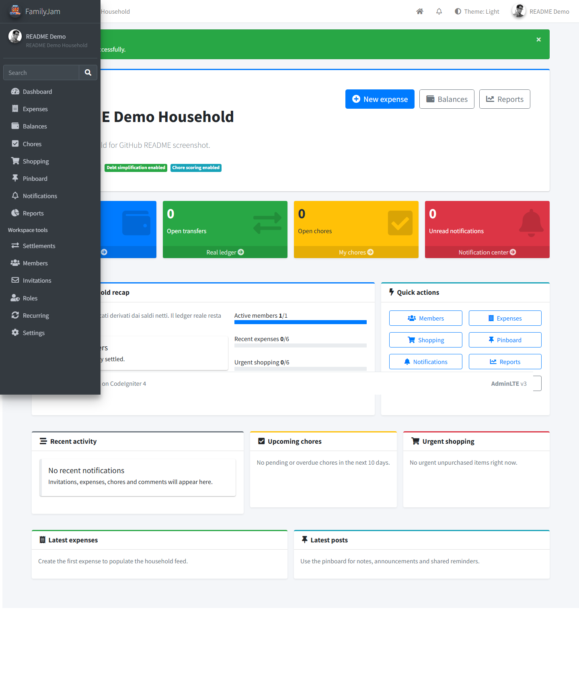

# FamilyJam



FamilyJam is a multi-tenant household management web application built with:

- PHP 8.3
- CodeIgniter 4
- MySQL 8
- Apache
- AdminLTE v3 for the UI foundation

It is designed for shared living scenarios where a household needs:

- shared expenses and balances
- settlements / debt cleanup
- recurring expenses
- chores and fairness tracking
- shopping lists
- pinboard posts and comments
- notifications
- household-level roles and permissions

## Overview

FamilyJam provides a household-scoped workspace for coordinating money, chores, shopping and communication across multiple members.

The application is built around:

- tenant isolation per household
- role-based access control
- shared financial tracking and settlement workflows
- operational modules for recurring activities and coordination
- an AdminLTE-based dashboard experience



## UI Foundation

The application UI uses **AdminLTE v3** as its visual base.

- Demo reference: https://adminlte.io/themes/v3/index2.html
- Source repository: https://github.com/ColorlibHQ/AdminLTE
- License: MIT

Local AdminLTE assets are included in the public asset tree used by the app.

## Main Features

- Authentication and user profile
- Multiple households per user
- Household switcher
- Household-scoped RBAC
- Expense tracking with equal / exact / percentage / shares split methods
- Settlements and balance overview
- Expense groups inside each household
- Recurring expense rules
- Chores with occurrences, reminders and fairness
- Shopping lists
- Pinboard and comments
- Notifications center with live polling
- Reports and charts

## Requirements

- PHP 8.3
- Apache with `mod_rewrite`
- MySQL 8
- Composer 2
- PHP extensions:
  - `intl`
  - `mbstring`
  - `mysqli`
  - `json`
  - `fileinfo`
- `gd` is recommended for avatar/image handling

## Project Structure

Important directories:

- `app/` application code
- `public/` public web root
- `writable/` logs, sessions, cache, uploads
- `database/` migrations, seeds, SQL fallback files
- `tests/` unit and integration tests

Recommended production layout:

- expose only `public/` to the web
- keep `app/`, `system/`, `vendor/`, `writable/`, `spark` out of the public web root

## Installation

### 1. Clone the repository

```bash
git clone https://github.com/your-account/familyjam.git
cd familyjam
```

### 2. Install dependencies

```bash
composer install
```

For production:

```bash
composer install --no-dev --optimize-autoloader
```

### 3. Create the environment file

Copy the example file:

```bash
cp .env.example .env
```

Then update at least:

- `app.baseURL`
- database credentials
- `session.savePath`
- SMTP credentials
- `encryption.key`

Generate a proper encryption key:

```bash
php spark key:generate
```

### 4. Create the database

Create a MySQL database with:

- charset: `utf8mb4`
- collation: `utf8mb4_unicode_ci`

Example `.env` database section:

```ini
database.default.hostname = localhost
database.default.database = familyjam
database.default.username = familyjam_user
database.default.password = change-me
database.default.DBDriver = MySQLi
database.default.port = 3306
database.default.charset = utf8mb4
database.default.DBCollat = utf8mb4_unicode_ci
```

### 5. Run migrations

```bash
php spark migrate
```

### 6. Run seeders

```bash
php spark db:seed DatabaseSeeder
```

This will populate:

- base permissions
- system roles
- role/permission links
- base expense categories

### 7. Make `writable/` writable

Required writable paths:

- `writable/cache`
- `writable/logs`
- `writable/session`
- `writable/uploads`

Example on Linux:

```bash
find writable -type d -exec chmod 775 {} \;
find writable -type f -exec chmod 664 {} \;
```

### 8. Run locally

```bash
php spark serve
```

Then open:

```text
http://localhost:8080
```

## Shared Hosting / Apache Deployment

### Recommended setup

Set the document root to:

```text
/path/to/project/public
```

### Fallback setup for classic shared hosting

If you cannot change the document root:

1. upload the full project outside `public_html`
2. copy the contents of `public/` into the public web directory
3. update the public `index.php` path to point to the real project root

Example:

```php
require '/home/account/familyjam/app/Config/Paths.php';
```

### Subfolder deployment

If you deploy under a subfolder like:

```text
https://example.com/FamilyJam/
```

then set:

```ini
app.baseURL = 'https://example.com/FamilyJam/'
```

and make sure your public `.htaccess` rewrite base is aligned if needed.

## Frontend

The UI is based on **AdminLTE v3** and its standard component ecosystem:

- AdminLTE layout and dashboard patterns
- Bootstrap components
- Font Awesome icons
- Chart.js for report and dashboard charts

Reference:

- AdminLTE demo: https://adminlte.io/themes/v3/index2.html
- AdminLTE source: https://github.com/ColorlibHQ/AdminLTE

## Cron Jobs

Recurring features and reminders use CLI commands.

Example cron entries:

```cron
*/15 * * * * /usr/bin/php /path/to/project/spark recurring:expenses-run >> /path/to/project/writable/logs/cron-recurring-expenses.log 2>&1
*/15 * * * * /usr/bin/php /path/to/project/spark chores:occurrences-run >> /path/to/project/writable/logs/cron-chore-occurrences.log 2>&1
0 * * * * /usr/bin/php /path/to/project/spark chores:reminders-run >> /path/to/project/writable/logs/cron-chore-reminders.log 2>&1
```

Adjust the PHP binary path to your server.

## SQL Fallback

If you cannot use `php spark migrate`, SQL fallback files are available in:

```text
database/mysql/
```

Run them in order:

1. `001_users_households.sql`
2. `002_authorization.sql`
3. `003_attachments_finance.sql`
4. `004_chores_shopping_pinboard.sql`
5. `005_notifications_audit.sql`
6. `006_seed_base_data.sql`

Migration + seed remains the preferred installation path.

## Email Configuration

FamilyJam supports SMTP for:

- invitations
- password reset
- verification scaffolding
- notification emails

Example:

```ini
email.fromEmail = 'no-reply@example.com'
email.fromName = 'FamilyJam'
email.protocol = 'smtp'
email.SMTPHost = 'smtp.example.com'
email.SMTPUser = 'no-reply@example.com'
email.SMTPPass = 'change-me'
email.SMTPPort = 587
email.SMTPCrypto = 'tls'
email.mailType = 'html'
```

## Testing

Run the test suite with:

```bash
vendor/bin/phpunit
```

The project includes unit and database/integration tests for:

- split calculations
- balances and settlements
- recurring expenses
- chores
- notifications
- authorization
- auth and invitation flows

## First Run Checklist

After installation, verify:

1. registration works
2. login works
3. profile updates work
4. household creation works
5. household switching works
6. expenses can be created
7. settlements can be recorded
8. shopping lists can be edited
9. pinboard works
10. notifications center loads
11. cron commands run

## Credits

- Framework: CodeIgniter 4
- UI foundation: AdminLTE v3
- Admin dashboard design reference: `index2.html` from the AdminLTE demo
